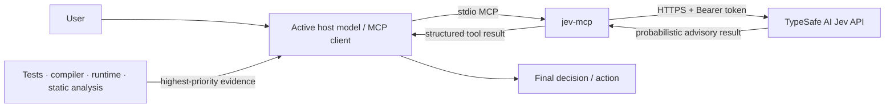

# jev-mcp

[](https://github.com/Afloat16/jev-mcp/actions/workflows/ci.yml)
[](LICENSE)
[](https://nodejs.org/)
[](https://modelcontextprotocol.io/)

**Unofficial, community-maintained MCP server for TypeSafe AI Jev.**

[简体中文](README.zh-CN.md) · [One-click install](docs/INSTALLATION.md) · [Quick start](docs/QUICKSTART.md) · [Examples](examples/README.md) · [Security](SECURITY.md) · [FAQ](docs/FAQ.md)

`jev-mcp` exposes TypeSafe AI's Jev decision model as four conservative,
read-only MCP tools for **bounded probabilistic decisions**.

It is intentionally designed as a **second-opinion layer**, not as a replacement
for the active coding/reasoning model.

> This project is not affiliated with, endorsed by, sponsored by, or an
> official product of TypeSafe AI or OpenAI.

## Why this exists

Strong coding agents are good at open-ended reasoning, code generation, debugging,
and repository-wide analysis. Jev is useful for a different class of problem:
small, explicit decisions that benefit from a structured probability signal.

Typical examples:

- retry vs rollback vs change strategy;
- route to one of several known tools or subsystems;
- estimate low / medium / high / critical change risk;
- evaluate a yes/no gate against a threshold;
- repeat the same bounded decision many times in an automated workflow.

The design rule is simple:

```text
deterministic evidence
        >
host-model repository-aware reasoning
        >
Jev probabilistic advice
```

A Jev result is **advisory**. It is never proof, never ground truth, and never
authorization for destructive or irreversible work.

## Architecture



The API key stays in the local process environment or a gitignored `.env` file.
It is not placed in the MCP client configuration.

**Privacy boundary:** anything placed in a tool's `state` is sent to the
configured TypeSafe API endpoint. Send only the minimum necessary, preferably
redacted state. See [Security and privacy model](docs/SECURITY-MODEL.md).

## Tool surface

| Tool | Use it for | Do not use it for |
| --- | --- | --- |
| `jev_decide` | Choosing among 2–255 explicit alternatives | Open-ended design or coding |
| `jev_route` | Routing among known tools/subsystems/workflows | Switching the user's selected model |
| `jev_risk_score` | Advisory low/medium/high/critical risk signal | Replacing tests or review |
| `jev_gate` | Yes/no probability against a threshold | Authorizing destructive actions |

All four tools are declared read-only. They do not edit files, execute shell
commands, deploy infrastructure, or change the model selected by the user.

Successful responses include local metadata similar to:

```json
{
  "jev_mcp_advisory": {
    "authority": "secondary_advisory",
    "finalDecisionBy": "active_host_model",
    "deterministicEvidenceOverrides": true,
    "doNotTreatProbabilityAsFact": true
  }
}
```

That metadata is added by this MCP server; it is not Jev model output.

## One-command install

No clone and no manual MCP JSON/TOML editing is required.

```bash
# Codex
npx -y --package=github:Afloat16/jev-mcp#main jev-mcp install codex

# Claude Code
npx -y --package=github:Afloat16/jev-mcp#main jev-mcp install claude-code

# Kimi Code
npx -y --package=github:Afloat16/jev-mcp#main jev-mcp install kimi

# ZCode
npx -y --package=github:Afloat16/jev-mcp#main jev-mcp install zcode

# Cursor
npx -y --package=github:Afloat16/jev-mcp#main jev-mcp install cursor

# Gemini CLI
npx -y --package=github:Afloat16/jev-mcp#main jev-mcp install gemini

# Configure every detected user-level client
npx -y --package=github:Afloat16/jev-mcp#main jev-mcp install all
```

On the first install, the CLI asks for the TypeSafe API key with **hidden
terminal input** and stores it only in `~/.jev-mcp/.env`. The key is not
inserted into client MCP configuration.

The installer preserves unrelated JSON settings and creates a
`.jev-mcp.bak` backup before changing an existing JSON config.

Supported targets include Codex, Claude Code, Kimi Code, ZCode, Cursor,
Gemini CLI, Windsurf-compatible config, generic `.agents/mcp.json`, and
project-scoped VS Code/Copilot Agent configuration.

See [Installation](docs/INSTALLATION.md) for all commands, uninstall steps,
Windows behavior, and the Cursor deeplink.

### Source install

For contributors or users who prefer a local checkout:

```bash
git clone https://github.com/Afloat16/jev-mcp.git
cd jev-mcp
./setup.sh
```

Windows PowerShell:

```powershell
git clone https://github.com/Afloat16/jev-mcp.git
cd jev-mcp
./setup.ps1
```

## Codex configuration

Add this to `~/.codex/config.toml` and replace the path:

```toml
[mcp_servers.jev]
command = "node"
args = ["/ABSOLUTE/PATH/TO/jev-mcp/dist/index.js"]
```

Restart the MCP host or start a new session after configuration changes.

For users who explicitly want a conservative cross-project Codex policy, merge:

```text
codex/AGENTS.jev-conservative.md
```

into your own `~/.codex/AGENTS.md`.

Do not copy unrelated existing instructions away.

## Which integration should I use?

| Situation | Recommended approach |
| --- | --- |
| Everyday interactive coding | Strong host model alone, or TypeSafe's agent skill |
| Learning Jev concepts / patterns | TypeSafe agent skill |
| Stable callable decision tools | `jev-mcp` |
| CI / agent orchestration | `jev-mcp` or a direct SDK integration |
| High-volume application logic | Direct SDK/API integration is often the cleanest |
| Need Jev to replace tests/compiler | Do not use Jev for that |

The MCP is most useful when the **tool boundary itself** matters: repeatability,
structured output, orchestration, explicit thresholds, or shared agent workflows.

## Configuration

| Variable | Required | Default | Description |
| --- | --- | --- | --- |
| `TYPESAFE_API_KEY` | yes | — | TypeSafe credential |
| `JEV_MODEL` | no | `jev-latest` | Jev model override |
| `TYPESAFE_BASE_URL` | no | `https://api.typesafe.ai` | API base URL |
| `TYPESAFE_TIMEOUT_MS` | no | `15000` | Request timeout, 250–120000 ms |
| `JEV_ENV_FILE` | no | project `.env` | Alternate env file path |

Existing process environment variables override values loaded from `.env`.

### Secret-handling rules

- Never commit `.env`.
- Never put API keys in `README`, `AGENTS.md`, MCP config, examples, issues,
  screenshots, or CI logs.
- If a key is ever pasted into a shared surface, rotate/revoke it.
- Run `npm run secrets:check` before publishing changes.

The bundled scanner is a guardrail, not a complete DLP system.

## Examples

See [examples/README.md](examples/README.md) for redacted examples covering:

- ambiguous CI failure routing;
- change-risk assessment;
- retry / rollback / escalate decisions;
- yes/no gates with explicit thresholds.

All examples intentionally use synthetic data and placeholders.

## Local verification

No TypeSafe API call:

```bash
npm run doctor
npm run check
```

Interactive MCP inspection:

```bash
npm run inspect
```

A live tool invocation in MCP Inspector uses your own TypeSafe account and may
consume provider credits.

## Project status

| Item | Status |
| --- | --- |
| Interface | 4 read-only MCP tools |
| Transport | local stdio |
| Node.js | 20+ |
| License | MIT |
| npm publishing | intentionally disabled |
| API dependency | TypeSafe-hosted System One API |
| Stability | pre-1.0; behavior may evolve |

The project follows semantic versioning in spirit, but while it remains below
`1.0.0`, minor releases may refine tool schemas or behavior. Breaking changes
should be documented in [CHANGELOG.md](CHANGELOG.md) and migration notes.

## Documentation

- [One-click installation](docs/INSTALLATION.md)
- [Supported AI clients](docs/CLIENTS.md)
- [Quick start](docs/QUICKSTART.md)
- [Architecture](docs/ARCHITECTURE.md)
- [Security and privacy model](docs/SECURITY-MODEL.md)
- [Troubleshooting](docs/TROUBLESHOOTING.md)
- [FAQ](docs/FAQ.md)
- [Roadmap](ROADMAP.md)
- [Governance](GOVERNANCE.md)
- [Support](SUPPORT.md)
- [Contributing](CONTRIBUTING.md)
- [Releasing](docs/RELEASING.md)
- [Changelog](CHANGELOG.md)

## Contributing

Focused issues and pull requests are welcome. Please read
[CONTRIBUTING.md](CONTRIBUTING.md) first and run:

```bash
npm run check
```

before opening a PR.

Security-sensitive reports should follow [SECURITY.md](SECURITY.md), not public
issue comments.

## License

MIT. See [LICENSE](LICENSE).

The license covers this repository's code only. Third-party services, names,
APIs, trademarks, pricing, and availability remain subject to their respective
owners. See [NOTICE](NOTICE).

## References

- TypeSafe AI documentation: https://docs.typesafe.ai/
- TypeSafe AI — Introducing System One Models & Jev: https://typesafe.ai/blog/introducing-system-one-models-and-jev
- Model Context Protocol TypeScript SDK: https://github.com/modelcontextprotocol/typescript-sdk
