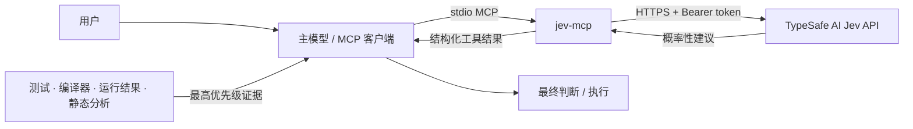

# jev-mcp

[](https://github.com/Afloat16/jev-mcp/actions/workflows/ci.yml)
[](LICENSE)
[](https://nodejs.org/)
[](https://modelcontextprotocol.io/)

**非官方、社区维护的 TypeSafe AI Jev MCP Server。**

[English](README.md) · [一键安装](docs/INSTALLATION.md) · [快速开始](docs/QUICKSTART.md) · [示例](examples/README.md) · [安全说明](SECURITY.md) · [FAQ](docs/FAQ.md)

`jev-mcp` 将 TypeSafe AI 的 Jev 决策模型暴露为 4 个保守、只读的 MCP 工具，
用于**边界明确的概率决策**。

它的目标不是替代 Astra、Sol 或其他强推理模型，而是提供一个结构化的**第二意见层**。

> 本项目与 TypeSafe AI、OpenAI 均无隶属、赞助、背书或官方产品关系。

## 为什么做这个项目

强 coding agent 擅长开放式推理、写代码、调试和理解大型仓库；Jev 更适合另一类问题：
候选项明确、输出结构固定、概率信号有价值的决策。

典型场景包括：

- retry / rollback / change strategy；
- 在几个已知工具、子系统或工作流之间路由；
- 给修改评估 low / medium / high / critical 风险；
- 用明确阈值做 yes/no gate；
- 在自动化 agent / CI 中反复执行同类 bounded decision。

本项目坚持以下优先级：

```text
测试 / 编译器 / 运行结果等确定性证据
        >
主模型基于仓库上下文的推理
        >
Jev 的概率性建议
```

Jev 的输出是**建议**，不是事实、证明，也不是执行破坏性操作的授权。

## 架构



API key 只放在本地进程环境变量或被 Git 忽略的 `.env` 文件中，不需要写入 MCP
客户端配置。

**隐私边界：** 传给工具的 `state` 会发送到你配置的 TypeSafe API endpoint。
只发送完成决策所需的最小、脱敏信息。详见
[安全与隐私模型](docs/SECURITY-MODEL.md)。

## 工具

| 工具 | 适合 | 不适合 |
| --- | --- | --- |
| `jev_decide` | 在 2–255 个明确选项中获得第二意见 | 开放式设计、写代码 |
| `jev_route` | 在已知工具 / 子系统 / 工作流之间路由 | 切换用户选定的主模型 |
| `jev_risk_score` | low / medium / high / critical 风险信号 | 代替测试或 code review |
| `jev_gate` | yes/no 概率与阈值比较 | 为破坏性操作提供授权 |

四个工具均声明为只读，不会修改文件、执行 shell、部署基础设施，也不会切换你选择的模型。

## 一条命令安装

无需手工修改 MCP JSON/TOML。安装器会把共享运行时安装到
`~/.jev-mcp/runtime`，隐藏输入 TypeSafe key，并自动配置目标 AI。

macOS / Linux：

```bash
# Codex
curl -fsSL https://raw.githubusercontent.com/Afloat16/jev-mcp/main/scripts/install.sh | bash -s -- codex

# Claude Code
curl -fsSL https://raw.githubusercontent.com/Afloat16/jev-mcp/main/scripts/install.sh | bash -s -- claude-code

# Kimi Code
curl -fsSL https://raw.githubusercontent.com/Afloat16/jev-mcp/main/scripts/install.sh | bash -s -- kimi

# ZCode
curl -fsSL https://raw.githubusercontent.com/Afloat16/jev-mcp/main/scripts/install.sh | bash -s -- zcode

# Cursor
curl -fsSL https://raw.githubusercontent.com/Afloat16/jev-mcp/main/scripts/install.sh | bash -s -- cursor

# Gemini CLI
curl -fsSL https://raw.githubusercontent.com/Afloat16/jev-mcp/main/scripts/install.sh | bash -s -- gemini
```

Windows PowerShell（把 `codex` 换成其他目标即可）：

```powershell
& ([scriptblock]::Create((irm https://raw.githubusercontent.com/Afloat16/jev-mcp/main/scripts/install.ps1))) -Target codex
```

自动配置检测到的用户级客户端：

```bash
curl -fsSL https://raw.githubusercontent.com/Afloat16/jev-mcp/main/scripts/install.sh | bash
```

TypeSafe key 只保存在本机 `~/.jev-mcp/.env`，不会写入各 AI 的 MCP 配置；
修改已有 JSON 配置前会自动保存备份。

当前支持 Codex、Claude Code、Kimi Code、ZCode、Cursor、Gemini CLI、
Windsurf 兼容配置、通用 `.agents/mcp.json`，以及项目级
VS Code/Copilot Agent 配置。

完整 Windows 命令、更新、卸载、`--skip-key` 和高级参数见
[安装说明](docs/INSTALLATION.md)。

### 从源码安装

适合贡献者或希望固定本地 checkout 的用户：

```bash
git clone https://github.com/Afloat16/jev-mcp.git
cd jev-mcp
./setup.sh
```

Windows PowerShell：

```powershell
git clone https://github.com/Afloat16/jev-mcp.git
cd jev-mcp
./setup.ps1
```

## Codex 配置

加入 `~/.codex/config.toml`，并替换绝对路径：

```toml
[mcp_servers.jev]
command = "node"
args = ["/ABSOLUTE/PATH/TO/jev-mcp/dist/index.js"]
```

修改配置后重启 MCP host 或开启新会话。

如果希望 Codex 在多个项目里采用 conservative policy，可将：

```text
codex/AGENTS.jev-conservative.md
```

合并到自己的 `~/.codex/AGENTS.md`。不要覆盖其他已有指令。

## Skill、MCP 还是直接 SDK？

| 场景 | 更合适的方式 |
| --- | --- |
| 日常交互式 coding | 强主模型本身，或 TypeSafe agent skill |
| 学习 Jev 的概念和模式 | TypeSafe agent skill |
| 需要稳定可调用的工具接口 | `jev-mcp` |
| CI / agent orchestration | `jev-mcp` 或直接 SDK |
| 高频应用逻辑 | 通常直接 SDK/API 更简单 |
| 想让 Jev 替代 tests/compiler | 不建议这样用 |

MCP 真正有价值的地方是**稳定工具边界**：结构化输出、可重复调用、概率阈值、
自动化工作流和共享 agent 工具。

## 配置项

| 环境变量 | 必须 | 默认值 | 说明 |
| --- | --- | --- | --- |
| `TYPESAFE_API_KEY` | 是 | — | TypeSafe credential |
| `JEV_MODEL` | 否 | `jev-latest` | Jev 模型覆盖 |
| `TYPESAFE_BASE_URL` | 否 | `https://api.typesafe.ai` | API 地址 |
| `TYPESAFE_TIMEOUT_MS` | 否 | `15000` | 250–120000 ms 请求超时 |
| `JEV_ENV_FILE` | 否 | 项目 `.env` | 其他 env 文件路径 |

进程环境变量优先于 `.env` 中的同名值。

### 密钥规则

- 永远不要提交 `.env`。
- 不要把 API key 放进 README、`AGENTS.md`、MCP 配置、示例、Issue、截图或 CI 日志。
- 如果 key 曾出现在共享界面，应立即轮换 / 撤销。
- 发布修改前运行 `npm run secrets:check`。

内置扫描器只是辅助保护，不是完整 DLP 系统。

## 示例与验证

示例见 [examples/README.md](examples/README.md)，全部使用虚构、脱敏数据。

不调用 TypeSafe API 的本地检查：

```bash
npm run doctor
npm run check
```

交互式 MCP Inspector：

```bash
npm run inspect
```

在 Inspector 中真正调用工具会使用你的 TypeSafe 账户，并可能消耗额度。

## 项目状态

| 项目 | 状态 |
| --- | --- |
| MCP interface | 4 个只读工具 |
| transport | local stdio |
| Node.js | 20+ |
| License | MIT |
| npm 发布 | 主动禁用 |
| 外部依赖 | TypeSafe-hosted System One API |
| 稳定性 | pre-1.0，行为仍可能演进 |

## 文档

- [一键安装](docs/INSTALLATION.md)
- [支持的 AI 客户端](docs/CLIENTS.md)
- [快速开始](docs/QUICKSTART.md)
- [架构](docs/ARCHITECTURE.md)
- [安全与隐私模型](docs/SECURITY-MODEL.md)
- [排障](docs/TROUBLESHOOTING.md)
- [FAQ](docs/FAQ.md)
- [Roadmap](ROADMAP.md)
- [Governance](GOVERNANCE.md)
- [Support](SUPPORT.md)
- [贡献指南](CONTRIBUTING.md)
- [发布说明](docs/RELEASING.md)
- [Changelog](CHANGELOG.md)

## 贡献与安全

欢迎聚焦的问题反馈和 Pull Request。提交前请阅读
[CONTRIBUTING.md](CONTRIBUTING.md)，并运行：

```bash
npm run check
```

安全问题请按 [SECURITY.md](SECURITY.md) 报告，不要把密钥或漏洞细节发到公开 Issue。

## License

MIT，见 [LICENSE](LICENSE)。

许可证只覆盖本仓库代码。TypeSafe AI、OpenAI 等第三方服务、API、名称、商标、价格与
可用性仍受各自条款和权利约束，见 [NOTICE](NOTICE)。
